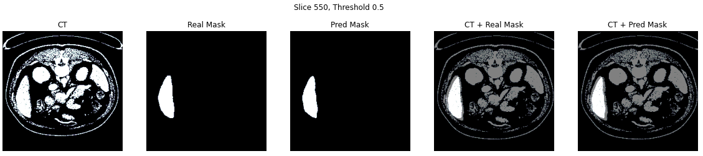
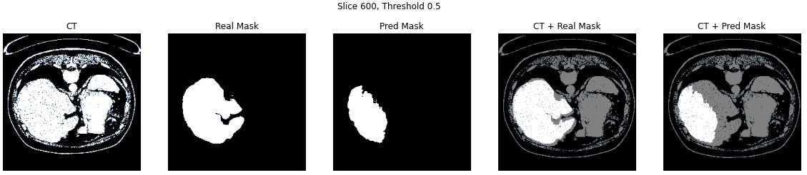
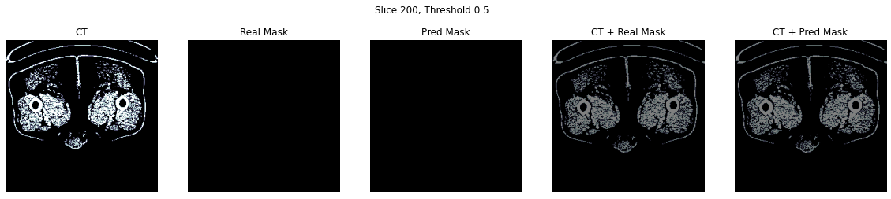
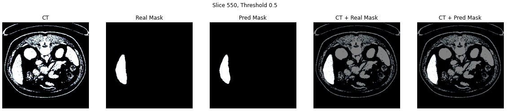
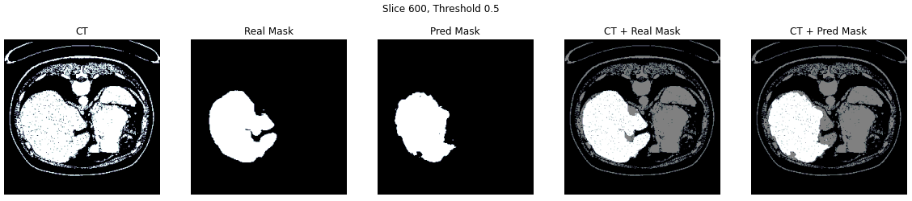

# Ablation study of UNet3+ on CT scans

- Markos Gkozntaris - (m.gkozntaris@student.tudelft.nl, 5347955)
- Nikolaos Gavalas - (n.gavalas@student.tudelft.nl, 5514762)

## Introduction

In Computer Vision, there exists no network architecture that is equally suitable and effective for all tasks. Different architectures can be used in order to tackle tasks in specific applications and datasets.

In this blogpost, we discuss the effectiveness of UNet3+ on datasets of CT scans, on the task of performing liver segmentation.

A direct comparison of [UNet](https://https://arxiv.org/abs/1505.04597) [1], and an ablation study of its extension [UNet3+](https://https://arxiv.org/abs/2004.08790) [2], will be addressed. Unet3+ was specifically designed for organ semantic segmentations in CT scans, i.e. associating each pixel of a CT slice with its class label. More specifically, the liver organ will be classsifed, using the same loss function in both cases.

The repository containing our implemetations of the models, as well as the data processing, evaluation and training scripts can be found [here](https://github.com/markos-gkozntaris/Does-UNet3-Generalize).

## Dataset

The dataset we used is comprised of 130 CT scans of the torso area, from the LiTS17 challenge (Liver Tumor Segmentation Challenge) [3]. The dataset also provides the segmentation masks for the liver. Its total size is around 50GB, including the masks.

Each of these volumes is a DICOM file containing an arbitrary number of 512x512 images, with this number ranging from 75 to 624, and each of these images corresponds to a different vertical "slice" of the torso. The values of the pixels belong to the [Hounsfield scale](https://en.wikipedia.org/wiki/Hounsfield_scale).

For example, let's visualize a slice (n. 55) from the first volume of the dataset:


Now because we want to specifically target the liver, we use the values of the Hounsfield scale that correspond to it as a filter. The result is the following:


Finally, we downsampled the slices and masks to 256 by max pooling, to decrease the size of the input. As can be seen in the resulting image, the information loss due to downsampling is tolerable:


To use this dataset more efficiently with PyTorch, we created a class extending PyTorch's DataSet class and created indices for it that allow random access.

## Instance segmentation

Before diving in the model architectures it would be wise to define the computer vision task that they aim to solve, the task of semantic segmentation.

Semantic segmentation, or image segmentation, is the task of clustering parts of an image together which belong to the same object class. It is a form of pixel-level prediction because each pixel in an image is classified according to a category, making the labels class-aware [4]. Visualy, this can be seen in the image below ([source](https://ai-pool.com/d/could-you-explain-me-how-instance-segmentation-works)), where also other computer vision taks are presented for comparison.


## Models

The two main architectures compared in this blog will be described, starting from UNet and continuing with its extension UNet3+ (which builds on top of the original UNet).

### UNet

UNet is a U-shaped encoder-decoder network architecture, which consists of four encoder blocks and four decoder blocks.

Its first path, the encoder, is used to capture the context in the image (serving as a feature extractor) and comprises of convolutional and max pooling layers. More specifically each encoder block consists of two 3x3 convolutions, each followed by a ReLU activation function in order to introduce non-linearity in the network, which helps in the better generalization of the training data. The output of this stage is fed to the same stage of the decoder part of the network, and is refered to as a skip connection.

This double convolution is followed by a 2x2 max-pooling, where the spatial dimensions (height and width) of the feature maps are reduced by half. 

The 5-th stage of the network is a connector between the encoder and the decoder, consisiting of only two 3x3 convolutions, each followed by a ReLU activation function.

On the other hand, the decoder, which is a symmetric expanding of the first path, comprises of upsamling and transpose convolution layers. It is used to enable precised localization. On a high level, its main goal is to take an abstract representation of the encoder and generate a semantic segmentation mask. 
The decoder block starts with a 2x2 transpose convolution, which is then conatenated with the corresponding skip connection feature map from the encoder block. Next, these concatenations are followed by two 3x3 convolutional layers, with each followed by a ReLU activation function.  

The output of the last decoder passes through a 1x1 convolution with sigmoid function. 


It is worth noting that the whole architecture consists of fully convolutional layers, allowing for input images of different sizes. Furthermore, the skip connections intoduced in this work, are used to provide additional information that helps the decoder generate better semantic features. They can act as a shortcut connection that helps the indirect flow of gradients to the earlier layers without any degradation.

Lastly, two main differences in the implementation can be observed compared to the original UNet paper. Both of them are chosen in order to have the same submodule implementation compared to the next model and remove any doubt of differences because of them.

*   batch normalisation is used before passing through the ReLU activation 
*   valid padding is applied after up-sampling instead of cropping the skip connections, before concatenating

The code for the building blocks of this model is attached below in case any parts remain unclear.


```
class DoubleConv(nn.Module):
    def __init__(self, in_channels, out_channels):
        super(DoubleConv, self).__init__()
        self.double_conv = nn.Sequential(
            nn.Conv2d(in_channels, out_channels, kernel_size=3, padding=0, bias=False),     
            nn.BatchNorm2d(out_channels),
            nn.ReLU(inplace=True),
            nn.Conv2d(out_channels, out_channels, kernel_size=3, padding=0, bias=False),
            nn.BatchNorm2d(out_channels),
            nn.ReLU(inplace=True)
        )

    def forward(self, x):
        return self.double_conv(x)

```

```
class Down(nn.Module):
    def __init__(self, in_channels, out_channels):
        super().__init__()
        self.maxpool_conv = nn.Sequential(
            nn.MaxPool2d(kernel_size = 2, stride = 2),
            DoubleConv(in_channels, out_channels)
        )

    def forward(self, x):
        return self.maxpool_conv(x)
```

```
class Up(nn.Module):
    def __init__(self, in_channels, out_channels, padding_type):
        super().__init__()
        self.padding_type = padding_type
        # half of the number of channels comes from concatination
        self.up = nn.ConvTranspose2d(in_channels, in_channels // 2, kernel_size=2, stride=2)
        self.conv = DoubleConv(in_channels, out_channels)

    def forward(self, x1, x2):
        x1 = self.up(x1)
        x2 = x2[:,:, (x2.size()[2]-x1.size()[2])//2:x2.size()[2]-(x2.size()[2]-x1.size()[2])//2, (x2.size()[3]-x1.size()[3])//2:x2.size()[3]-(x2.size()[3]-x1.size()[3])//2]
        x = torch.cat([x2, x1], dim=1)
        return self.conv(x)
```

### UNet3+

Considering that UNet3+ is an extension of UNet, the in depth explenation of the latter was necessary. On this proposed model the decoder and encoder blocks remain the same, however new skip connections were introduced. It made full use of the multi-scale features by introducing full-scale skip connections, which incorporate low-level details with high-level semantics from feature maps in full scales. Beyond that also deep supervision was introduced as well as a classification-guided module, to reduce over-segmentation on none-organ images by jointly training with an image-level classification. However the two last improvements will not be used in the results produced for this ablation study. 

Note that if a reader would like to also get results using them, an implementation of the model with deep supervision and cgm can be found in [our repo](https://https://github.com/markos-gkozntaris/Does-UNet3-Generalize).

#### Full-scale skip connections

None of the previous UNet variants explored sufficient information from full scales, failing to explicitly learn the position and boundary of an organ. To remedy this defect each decoder layer in UNet 3+ incorporates both smaller-scale and same-scale feature maps from encoder and larger-scale feature maps from decoder, which capture fine-grained details
and coarse-grained semantics in full scales. 

In contrast to UNet, a set of inter decoder-encoder skip connection delivers the low-level detailed information to an encoder stage, from all the current and higher encoder stages by applying non-overlapping max pooling. On the other, hand a chain of intra decoder skip connections transmits the high-level semantic segmentation from lower stage decoder stages by applying linear interpolation.

A figure is provided to help in visualizing it. Furthermore, the decoder 3 stage shown will be analyzed as a hands-on example. 


For the higher decoder stages (in this case stage 1 and 2), a maxpooling followed by a DoubleConv + BN + ReLU is applied. The maxpooling is based on the distance of the stage to the current one. 

In general, we get **$maxpool(2^i)$**, where $i$ is equal to _current decoder stage index_ minus the _encoder index where the skip connection is coming from_. For example, for decoder 3 and a skip connection coming from encoder 1, we would have $i = 3-1 = 2$, so $maxpool(4)$.

On the other hand, the lower encoder stages are not used, but the high-level semantic information comes instead from the larger-scale decoder stages (here stage 4 and 5). In order to concatenate them, considering the difference in tensor size from the intermediate operations, contrary to previously when maxpooling was applied, no bilinear interpolation is used with a scale factor $2^i$.

All this skip connections are concatenated with the direct connection from the same stage encoder, and are passed through the DoubleConv + BN + ReLU, in order to create the output of each decoder stage.

Same as before, a piece of code is provided for the creation of $De_3$:

Class definition:

```
'''create X_DE^3'''
self.h1_PT_hd3 = nn.MaxPool2d(4, 4, ceil_mode=True)
self.h1_PT_de3_Conv_BN_ReLU = Conv_BN_ReLU(filters[0],self.CatChannels)

self.h2_PT_hd3 = nn.MaxPool2d(2, 2, ceil_mode=True)
self.h2_PT_de3_Conv_BN_ReLU = Conv_BN_ReLU(filters[1],self.CatChannels)

self.h3_PT_de3_Conv_BN_ReLU = Conv_BN_ReLU(filters[2],self.CatChannels)

self.hd4_UT_hd3 = nn.Upsample(scale_factor=2, mode='bilinear') 
self.h4_PT_de3_Conv_BN_ReLU = Conv_BN_ReLU(self.UpChannels,self.CatChannels)

self.hd5_UT_hd3 = nn.Upsample(scale_factor=4, mode='bilinear')
self.h5_PT_de3_Conv_BN_ReLU = Conv_BN_ReLU(filters[4],self.CatChannels)  

self.de3_Conv_BN_ReLU = Conv_BN_ReLU(self.UpChannels,self.UpChannels)
```

Forward pass:

```
'''create X_DE^3'''
h1_PT_hd3 = self.h1_PT_de3_Conv_BN_ReLU(self.h1_PT_hd3(x1))
self.debug("h1_PT_hd3 = ", h1_PT_hd3.size())

h2_PT_hd3 = self.h2_PT_de3_Conv_BN_ReLU(self.h2_PT_hd3(x2))
self.debug("h2_PT_hd3 = ", h2_PT_hd3.size())

h3_Cat_hd3 = self.h3_PT_de3_Conv_BN_ReLU(x3)
self.debug("h3_Cat_hd3 = ", h3_Cat_hd3.size())

hd4_UT_hd3 = self.h4_PT_de3_Conv_BN_ReLU(self.hd4_UT_hd3(hde4))      
self.debug("hd4_UT_hd3 = ", hd4_UT_hd3.size())

hd5_UT_hd3 = self.h5_PT_de3_Conv_BN_ReLU(self.hd5_UT_hd3(hde5)) 
self.debug("hd5_UT_hd3 = ", hd5_UT_hd3.size())

hde3 = self.de3_Conv_BN_ReLU(torch.cat((h1_PT_hd3, h2_PT_hd3, h3_Cat_hd3, hd4_UT_hd3, hd5_UT_hd3), 1)) 
```

## Training

### Data Loading

We configured the data-loaders to extract slices from the volumes in triples. This process can be visualized as having a rolling window over a sequence of (adjacent) slices, specifically of size 3 (as this is the value recommended in [2]). These triples comprise the 3 channels of the input, so after collation with the other triples, the dimensionality of the input is $(batchSize \times 3 \times 256 \times 256)$.

### Optimizer and Loss

Considering that in this work the main purpose is to exploit the usefulness of adding more skip connections (so passing features that might have been lost on different stages), no bells and whistles will be used for training. 
Below the optimizer and loss function can be found which was the same on both cases:

```
optimizer = Adam(net.parameters(), lr=5e-4)
criterion = nn.BCEWithLogitsLoss()
```
## Difficulties

The two main difficulties faced while implementing this project were:

- some technicalities regarding the data-loading part
- concatenation of tensors of different sizes during the implementation of the UNet3+ model
- relatively limited computational resources

Regarding the data-loading, the infrastucture we worked on initially did not allow for persistence of some intermediate pre-processed form of the dataset. Hence, a caching layer was implemented to make the loading more efficient by lowering disk access for consecutive triples, as a way to mitigate this limitation.

As for the computational resources, training models with this many number of parameters and such dataset size, was quite a challenge, even for this number of epochs. Each epoch of UNet took about 45 minutes to train on our infrastructure, and UNet3+ about 3.5 hours using one NVIDIA P100 GPU, and 6 hours on one NVIDIA T4 GPU which we later had to switch to.

## Results

### Comparison of the two architectures

Concerning the sizes of the two models, the UNet3+ has less parameters, but the forward/backward pass size is greater, probably due to the concatenations happening on the decoder side of the network. The exact numbers are provided in the following table:

|  | UNet | UNet3+ |
| ----  | ---- | -----  |
| Total parameters | 31,037,633 | 26,967,809 |
| Forward/backward pass size (MB) | 879.64 | 3447.00 |
| Params size (MB) | 118.40 | 102.87 |
| Estimated Total Size (MB) | 998.79 | 3550.62 |

The train and test loss curves for 11 epochs are shown below:


In addition, four examples of the results are provided corresponding to the following two cases:

1. Three slices from three different volumes of the CT scans.
2. A case with no mask on the ground truth data,

#### UNet









#### UNet3+







## Conclusions

Based on the two models trained for 11 epochs, the UNet3+ proved to perform better on this dataset, as can be noticed by the visualised results. It seems visually that the Intersection-Over-Union score is also higher. As expected from the introduction of new skip connections, more fine details were preserved leading to a better segmentation result.

Furthermore, visually in all samples assessed, both networks did not return false negatives (i.e. when a mask was empty, so was the predicted mask).

This was a fun project for us to work on and we learned a lot.

## References

[1] Ronneberger, Olaf, Philipp Fischer, and Thomas Brox. "U-net: Convolutional networks for biomedical image segmentation." International Conference on Medical image computing and computer-assisted intervention. Springer, Cham, 2015.

[2] Huang, Huimin, et al. "Unet 3+: A full-scale connected unet for medical image segmentation." ICASSP 2020-2020 IEEE International Conference on Acoustics, Speech and Signal Processing (ICASSP). IEEE, 2020.

[3] Bilic, Patrick, et al. "The liver tumor segmentation benchmark (lits)." arXiv preprint arXiv:1901.04056 (2019).

[4] Lin, Tsung-Yi, et al. "Microsoft coco: Common objects in context." European conference on computer vision. Springer, Cham, 2014.
